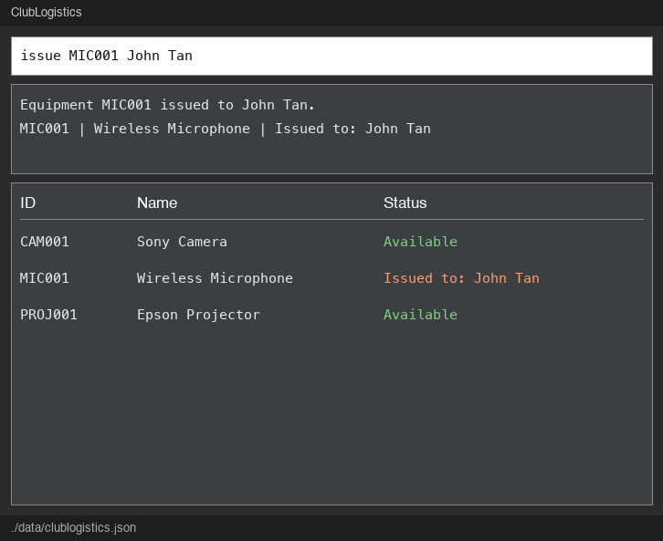

**ClubLogistics is a desktop application for student club logistics coordinators to track reusable equipment and who it is currently issued to.** Most user interactions happen using a CLI (Command Line Interface).

* If you are interested in using ClubLogistics, head over to the [_Quick Start_ section of the **User Guide**](UserGuide.html#quick-start).
* If you are interested in developing ClubLogistics, the [**Developer Guide**](DeveloperGuide.html) is a good place to start.

**Acknowledgements**

* Libraries used: [JavaFX](https://openjfx.io/), [Jackson](https://github.com/FasterXML/jackson), [JUnit5](https://github.com/junit-team/junit5)

* This project is based on the AddressBook-Level3 project created by the [SE-EDU initiative](https://se-education.org).
